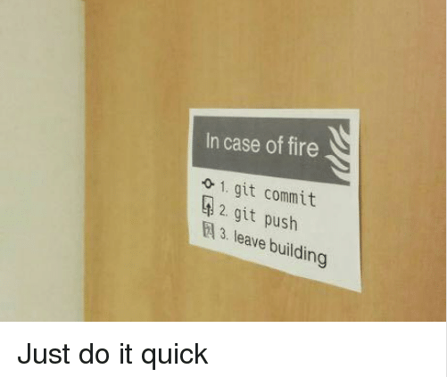
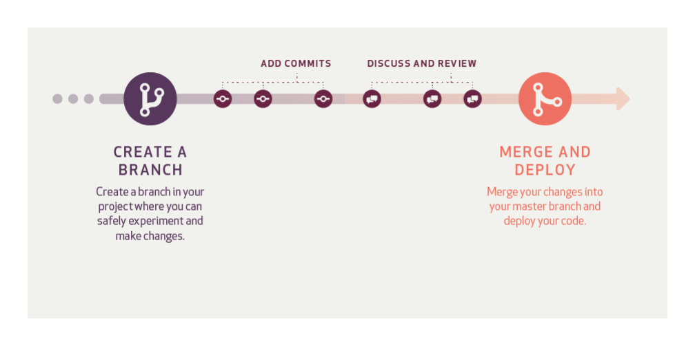
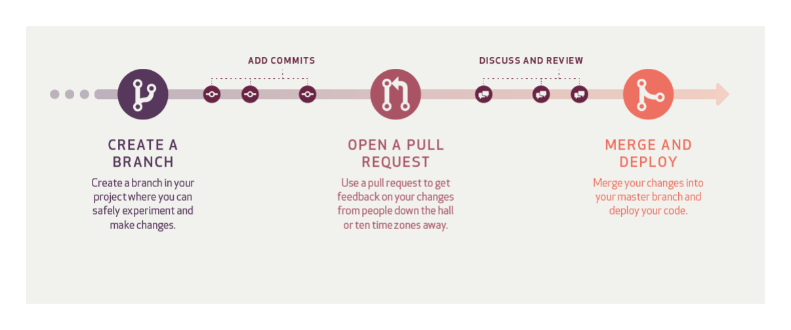

# [Git workflow](#git-workflow)  

A Git Workflow is a recipe or recommendation for how to use Git to accomplish work in a consistent and productive manner. Git workflows encourage users to leverage Git effectively and consistently. Git offers a lot of flexibility in how users manage changes. Given Git's focus on flexibility, there is no standardized process on how to interact with Git. When working with a team on a Git managed project, it’s important to make sure the team is all in agreement on how the flow of changes will be applied.

## [Successful Git workflow](#successful-git-workflow)  

When evaluating a workflow for your team, it's most important that you consider your team’s culture. You want the workflow to enhance the effectiveness of your team and not be a burden that limits productivity. Some things to consider when evaluating a Git workflow are:

* Does this workflow scale with team size?
* Is it easy to undo mistakes and errors with this workflow?
* Does this workflow impose any new unnecessary cognitive overhead to the team?

## [Best Practices on Working With Git](#git-best-practices)  

* __Create and Provide Branches to Developers As Needed__  

Each team member must have their own branches where they can work simulatneously with other developers. This allows the developer to commit their own work and unit test their work safely  without affecting others work. Senior developers or the project manager can name this branch very descriptively or just by prefixing those developer branches, for example ``dev-ariel``, ``dev-arriz``, or ``dev-vic``. It is a good idea as well to create branches from a certain milestone or features with a ``dev`` prefix like ``dev-milestone-1``, ``dev-build-1.0``, or ``dev-db-layer``.

* __Avoid Developers Committing in a Single Branch__  

Generally this is a bad practice and does not adhere to the principle of "__collaboration__" and definitely defeat the purpose git and version control in general. The following detailed arguments against this practice:

    * Almost impossible to track and code review commits.
    * Developers will have to check if there are newer commits to be pulled before they can commit.
    * Difficult to avoid data loss if bug is introduced and if there is a need to execute a rollback on certain commit.

* __Commit Every End of Task or Work__  

Every end of task, developers must commit their work and commit messages must be descriptive enough so that senior developers can know easily about your work on that specific commit. Avoid commiting large chunk of work or code, even in the case of single line of code the developer must commit it. This is to avoid data loss in case your machine will be damaged or corrupted and in case of extreme circumstance like fire.  

      

* __Code Review Before Merge__  

Senior developers should code review first the work of other branches and make sure they follow the standards set for the team before marging them in staging and production branches.

* __Don't Forget to Resolved All Conflicts__  

Before pushing and building for production make sure after merge the source code should be free from conflicts.

* __Mark and Tag Release Builds__  

All release builds should be tagged properly or even create a new branch for it.

## [Close Small Team Workflow](#close-small-team-workflow)  

This workflow is based on [github workflow](https://guides.github.com/introduction/flow/ "Github Workflow"). This is not a dogmatic workflow and feel free to modify and make improvements depending on the project, the team, or preferences.

1. Create needed branches typically one per team member and others for staging, production (master), and other feature branches.
2. Add commits.
3. Call the attention of the senior developer or the code review in charge to discuss and review your commits.
4. Merge and deploy.

  

### [Pros](#close-small-team-workflow-pros)

* Simple and lightweight.
* Very good on close small teams (2 to 4 members within speaking distance).

### [Cons](#close-small-team-workflow-cons)

* Not good with very large teams.  
* Not good with team where team members are situated remotely.

## [GitHub Workflow](#github-workflow)  

[Github Workflow](https://guides.github.com/introduction/flow/ "Github Workflow") is a lightweight, branch-based workflow that supports teams and projects where deployments are made regularly. Download the PDF version [here](https://guides.github.com/pdfs/githubflow-online.pdf "Github Workflow PDF").

1. Create needed branches typically one per team member and others for staging, production (master), and other feature branches. If working in a very large team allow forks on each team member and handle their commits via pull requests.
2. Add commits.
3. Open a Pull Request.
4. Discuss and review the commits.
5. Merge and deploy.

  

### [Pros](#github-workflow-pros)  

* Simple and lightweight.
* Very good on close small teams (2 to 4 members within speaking distance).
* Very appropriate on very large and diverse team.

### [Cons](#github-workflow-cons)  

* A little tidious to follow and take a bit of time to be used to.
