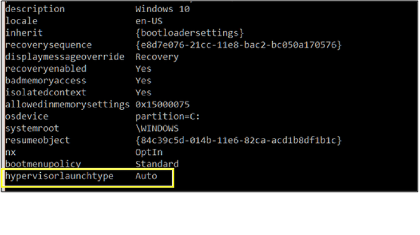

## Troubleshooting Common Errors

### ![Virtualbox Raw-mode is unavailable courtesy of Hyper-V windows 10]  (https://stackoverflow.com/questions/50053255/virtualbox-raw-mode-is-unavailable-courtesy-of-hyper-v-windows-10 "Virtualbox Raw-mode is unavailable courtesy of Hyper-V windows 10")
You need to disable Hypervisior to check new application that use VT-x before ir launch.  
Do the following:  
1. Open command prompt / PowerShell as Administrator.  
2. Run bcdedit to check hypervisor status:  
    ``bcdedit``
3. Check hypervisor launch type:  
      
4. If is set to **auto** then disable it:  
    ``bcdedit /set hypervisorlaunchtype off``  
5. Reboot host machine and launch VirtualBox again.  